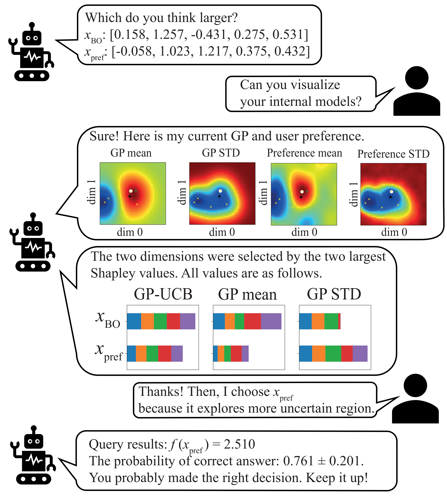

# CoExBO
Source code for the AISTATS 2024 paper<br>
"Looping in the Human: Collaborative and Explainable Bayesian Optimization" [paper](https://proceedings.mlr.press/v238/adachi24a.html)

## DEMO for practitioners/researchers
We prepared an example of CoExBO with battery example. <br>
- Demo1 human feedback for battery experiments.ipynb
- Demo2 synthetic human response.ipynb

## CoExBO in a nutshell.
<br>

Collaborative and Explainable BO (CoExBO)<br>
1. BO combines experimental results and expert preferences.<br>
2. BO generates pairwise candidates along with explanations.<br>
3. Human interprets the acquisitions and picks their preferred candidate<br>
4. Human conducts experiments and repeat step 1.<br>

# Explainability
<br>

Utilising GP-SHAP, we can provide insights into the undergoing of the BO by attributing feature importance to the followings:
- Surrogate GP model
- Acquisition function (GP-UCB)

# Dependencies
botorch 0.8.4
gpytorch 1.10
torch 1.13.0

## Cite as
Please cite this work as
```
@inproceedings{adachi2024looping,
  title={Looping in the Human: Collaborative and Explainable Bayesian Optimization},
  author={Adachi, Masaki and Planden, Brady and Howey, David and Osborne, Michael A and Orbell, Sebastian and Ares, Natalia and Muandet, Krikamol and Chau, Siu Lun},
  booktitle={International Conference on Artificial Intelligence and Statistics},
  pages={505--513},
  year={2024},
  organization={PMLR}
}
```
